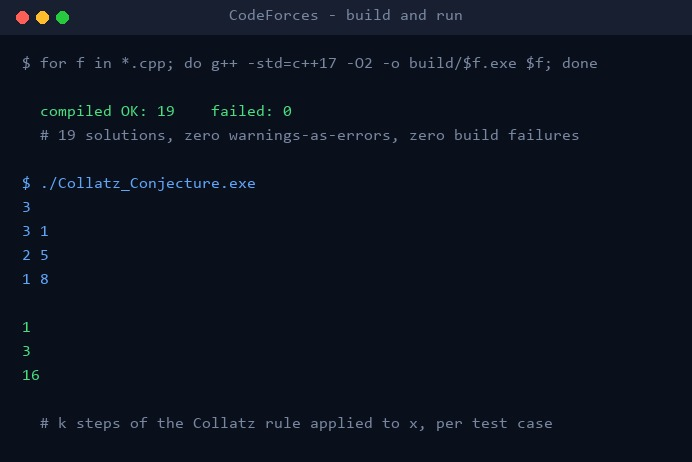

# Codeforces Solutions

My C++ solutions to Codeforces practice problems, one self-contained file per problem.

Written during Year 2 of my computer engineering degree to practise problem solving and C++.



## Solutions

| File | Problem | Technique |
|---|---|---|
| `ASCII _Art_Contest.cpp` | ASCII Art Contest: read three scores, print the middle one, or "check again" if the highest and lowest differ by 10 or more | Sorting, implementation |
| `Collatz_Conjecture.cpp` | Given the value `x` reached after `k` Collatz steps, find a number that could have been the start | Math, reverse simulation |
| `Maple_multiplic.cpp` | Minimum number of operations for Maple to make `a` equal to `b` (0, 1 or 2 depending on divisibility) | Math |
| `Maximum_Distance_To_Port.cpp` | Maximum distance to a port. Unfinished: reads the input only | Graphs |
| `balls.cpp` | Pick a position `b` next to `a` that is strictly closer than `a` to as many of the given values as possible | Brute force |
| `be_positive.cpp` | Minimum number of +1 operations to make the product of an array strictly positive | Greedy, counting |
| `cowsAchickens.cpp` | Count the possible numbers of chickens (2 legs) and cows (4 legs) that give exactly `n` legs | Brute force, math |
| `interations.cpp` | Total number of unit steps needed to turn array `a` into array `b` (sum of absolute differences) | Implementation |
| `maxAvarege.cpp` | Maximum average of a subarray, which equals the largest element | Math observation |
| `mex.cpp` | MEX of an array: the smallest non-negative integer not present | Brute force |
| `min_p_max.cpp` | Smallest difference between any two elements | Sorting |
| `names.cpp` | Most frequent value in an array and its frequency. Practice exercise with a hard-coded array, no input | Counting |
| `nephews.cpp` | Smallest number to add to `n` to make it divisible by 3 | Math, modulo |
| `round2.cpp` | Count how many contest rounds are rated for a player whose rating drops by `d` after each rated round | Simulation |
| `sequence.cpp` | Sum of an alternating sequence `x, -x, x, ...` of length `n` | Math, parity |
| `sequenceGame.cpp` | Check whether `x` lies between the minimum and maximum of the array | Implementation |
| `squere.cpp` | Check whether four sticks can form a square (all lengths equal) | Implementation |
| `str_result.cpp` | Build the string that results from Dima and Vlad adding characters to the front or back of a string | Strings, simulation |
| `swapGame.cpp` | Souvlaki VS. Kalamaki (problem A): decide whether the array can end up sorted, answered YES or NO | Sorting, parity |

## Run it

You need a C++ compiler such as `g++`. Compile a single solution:

```bash
g++ -std=c++17 -O2 Collatz_Conjecture.cpp -o Collatz_Conjecture
./Collatz_Conjecture
```

Then type the input in the Codeforces format, for example:

```
3
3 1
2 5
1 8
```

To compile every solution at once (Bash):

```bash
mkdir -p build
for f in *.cpp; do g++ -std=c++17 -O2 "$f" -o "build/${f%.cpp}"; done
```

The quotes matter because `ASCII _Art_Contest.cpp` has a space in its name.

## How it works

- Every file is a standalone program with its own `main()`. There are no shared headers or libraries.
- Input is read from standard input and the answer is written to standard output, the same way the Codeforces judge runs a submission.
- Most solutions follow the usual pattern of reading the number of test cases `t` and solving each case in a loop.

## Project structure

```
*.cpp           one solution per file
screenshots/    images used in this README
.gitignore      ignores compiled binaries and the build/ folder
```
